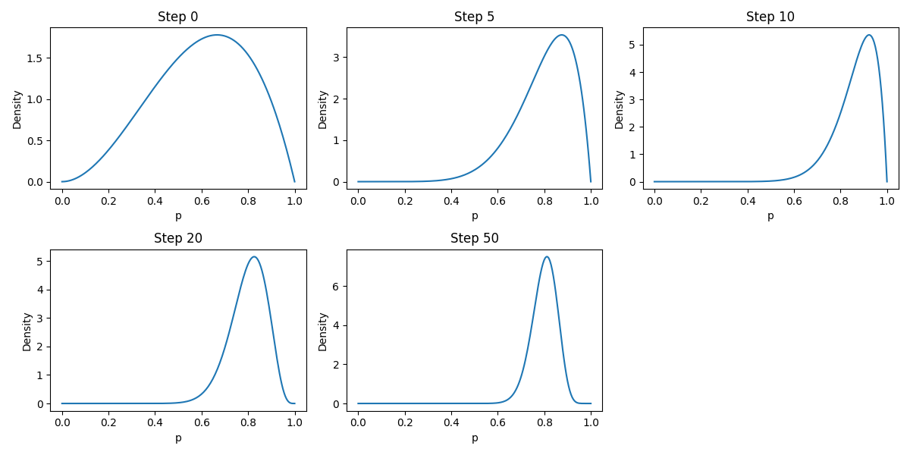
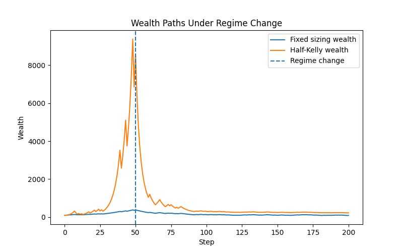
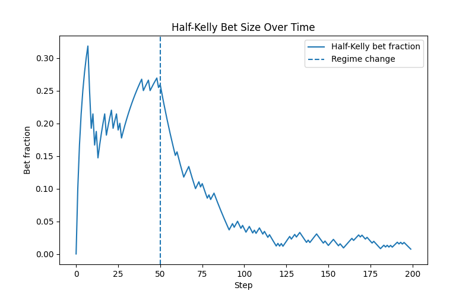

# Adaptive Position Sizing and Regime Detection in Trading Systems

## Project Overview

This project investigates how a trader should learn and size positions to manage risk under uncertainty, particularly in environments where the underlying edge may change over time.

To study this in a controlled setting, I begin with a simulation framework based on repeated coin flips. Each flip represents a trade, where outcomes (“Heads” or “Tails”) correspond to profit and loss signals. The true probability of success is unknown and must be inferred from sequential observations.

Using **Monte Carlo simulation**, I run many independent paths to evaluate strategy performance in terms of:

- wealth growth
- drawdowns
- robustness across different scenarios

We develop the project from a simple static idea into increasingly adaptive strategies.

The project initially utilises a static fixed-fraction strategy, where sizing does not respond to outcomes and further introduce fractional Kelly sizing strategy. I extend the project by utilising a continuous Beta distribution over discrete belief priors, a more realistic model for updating beliefs after each observation. 

To capture more realistic trading dynamics , I introduce a regime change, where the true probability shifts from a strong positive edge to a no-edge environment. This creates a non-stationary setting in which strategies must balance responsiveness and stability.

To address this, I develop:

- Rolling-window estimator (fast but noisy)
- Bayesian estimator (stable but slow)
- Hybrid model that combines both approaches

Finally, I incorporate a regime detection mechanism, where divergence between models is used as a signal to reduce position sizes in order to limit drawdowns.

---

## Beta Distribution (D1)

To move from a discrete belief model to a more realistic continuous framework, I model the unknown edge p using a Beta distribution (p ~ B(alpha, beta)):

Starting from a prior of Beta(2,2), beliefs are updated sequentially after each outcome:

- Heads increases alpha
- Tails increases beta

The posterior mean (alpha/(alpha+beta)) provides an estimate of the underlying edge, while the full posterior captures the model's confidence.

For true_p = 0.8, edge is strong, hence the beta distribution quickly concentrates around the posterior mean.

This is useful because trading decisions should depend not only on the estimated edge, but also on how certain the model is that the edge is favourable. I use the posterior distribution to calculate:

- the probability that the edge is bad (p <= 0.5)
- the probability that the edge is good (p > 0.5)

These probabilities are then used for stopping and detection rules.

---

## Regime Change (D2)

### Setup

To test how position sizing strategies behave when the trading environment changes, I introduce a regime shift into the simulation.

Instead of assuming that the underlying edge is constant, the true probability changes over time:

- for the first 50 steps: true_p = 0.8
- after step 50: true_p = 0.45

This creates a non-stationary environment in which a strategy that was previously profitable becomes unprofitable.

The purpose of this experiment is to study a central trading problem: a model may be correct for a period of time, become highly confident, and then fail when the environment changes.

I compare two sizing rules:

- **Fixed fraction sizing**
    - A constant 5% of wealth is allocated each round, regardless of confidence.
- **Half-Kelly sizing**
    - Position size is determined by the Bayesian posterior estimate of the edge: f = max(0, 0.5 * (2 * expected p - 1))

This means the Half-Kelly strategy becomes more aggressive as the model grows more confident.

### Why regime change matters

In a stationary environment, growing confidence is generally beneficial as the trader learns the edge and increases size accordingly.

However, when the environment changes, that same confidence can become dangerous.

Because the Bayesian estimate uses all past observations, it is slow to adapt after the regime shift. This creates a lag between:

- the true edge, which has deteriorated
- the estimated edge, which remains elevated due to earlier strong outcomes

As a result, the trader may continue sizing too aggressively even after the edge has disappeared (overconfidence)

This plot compares the true probability with the Bayesian posterior mean over time.
- Before step 50, the posterior mean converges upward toward the strong positive edge
- After step 50, the posterior mean begins to fall, however, it only adapts gradually, because the posterior is anchored to past data

**This visualises the central problem of adaptation lag**

This plot compares how fixed and Half-Kelly strategies perform under the same regime shift.
- Fixed sizing grows more slowly but avoids extreme overexposure as betting size does not drastically change
- Half-Kelly compounds rapidly in the favourable regime. But after the shift, Half-Kelly often experiences a sharp deterioration because it is still betting based on stale confidence

This plot shows how the Kelly position size evolves over time.
- In a high-edge regime, bet sizes increase as the posterior mean rises 
- after the regime change, the model continues betting aggressively for a period experiencing a delayed reduction in size 

### Key insights

*** Confidence is helpful only while the environment remains stable ***
In a stationary setting, Bayesian learning improves sizing. In a changing setting, old information can become a liability.
	•	The main problem is not estimation alone, but adaptation speed
*** A model can remain statistically “reasonable” while still reacting too slowly to structural change ***
	•	Kelly sizing amplifies model error
*** Because position size increases with estimated edge, an outdated belief can produce large losses after a regime shift ***
	•	Fixed sizing sacrifices upside for robustness
*** It does not exploit the strong regime as efficiently, but it avoids the most severe overbetting problem ***
	•	Regime change introduces model risk
*** The strategy is no longer just uncertain about the value of the edge — it is uncertain whether the underlying process itself has changed ***

## Adaptation (D3)

---

## Hybrid Models (D4)

### Key Insights

---

## Regime Detection & Control (D5)

### Key Insights

---

## Limitations

---

## Tech Stack
- Python
- NumPy
- Pandas
- Matplotlib / Seaborn / Scipy

---
