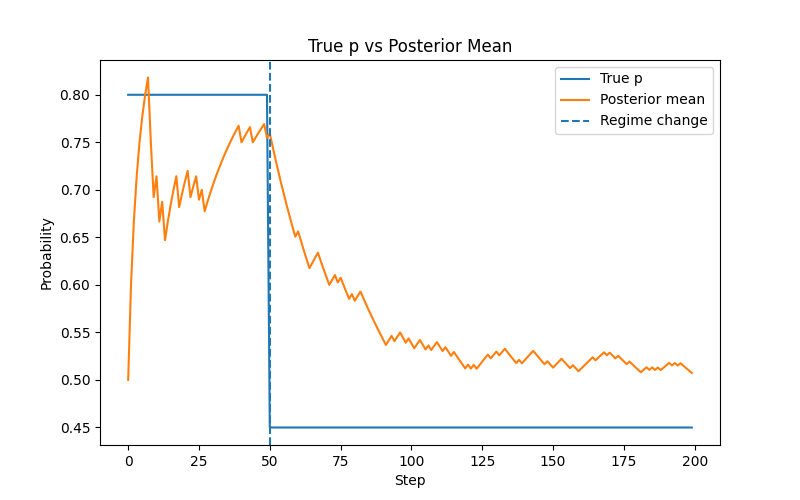
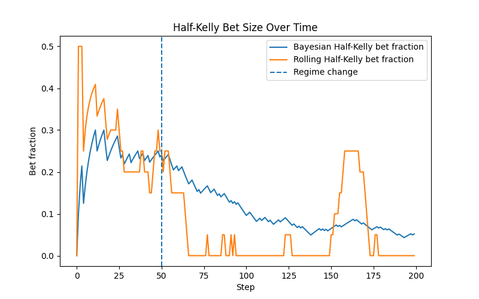
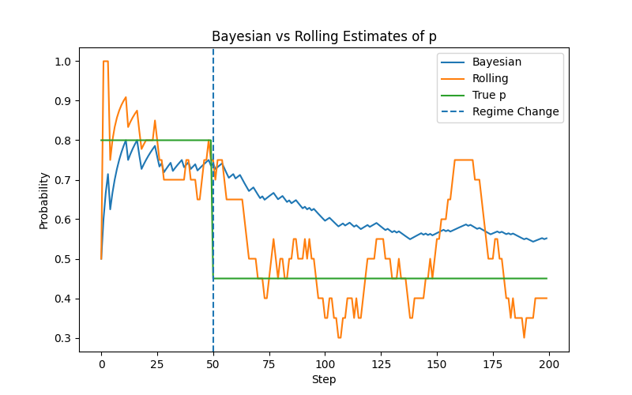
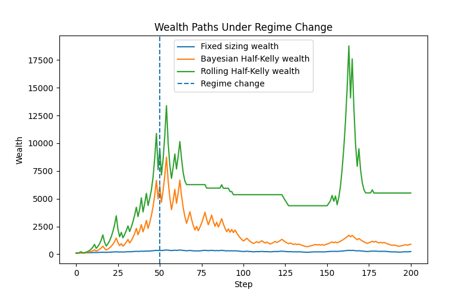

# Adaptive Position Sizing and Regime Detection in Trading Systems

## Project Overview

This project investigates how a trader should learn and size positions to manage risk under uncertainty, particularly in environments where the underlying edge may change over time.

To study this in a controlled setting, I begin with a simulation framework based on repeated coin flips. Each flip represents a trade, where outcomes (“Heads” or “Tails”) correspond to profit and loss signals. The true probability of success is unknown and must be inferred from sequential observations.

Using **Monte Carlo simulation**, I run many independent paths to evaluate strategy performance in terms of:

- wealth growth
- drawdowns
- robustness across different scenarios

We develop the project from a simple static idea into increasingly adaptive strategies.

The project initially utilises a static fixed-fraction strategy, where sizing does not respond to outcomes and further introduce fractional Kelly sizing strategy. I extend the project by utilising a continuous Beta distribution over discrete belief priors, a more realistic model for updating beliefs after each observation. 

To capture more realistic trading dynamics , I introduce a regime change, where the true probability shifts from a strong positive edge to a no-edge environment. This creates a non-stationary setting in which strategies must balance responsiveness and stability.

To address this, I develop:

- Rolling-window estimator (fast but noisy)
- Bayesian estimator (stable but slow)
- Hybrid model that combines both approaches

Finally, I incorporate a regime detection mechanism, where divergence between models is used as a signal to reduce position sizes in order to limit drawdowns.

---

## Beta Distribution

To move from a discrete belief model to a more realistic continuous framework, I model the unknown edge p using a **Beta distribution** (p ~ B(alpha, beta)):

Starting from a prior of Beta(2,2), beliefs are updated sequentially after each outcome:

- Heads increases alpha
- Tails increases beta

The posterior mean (alpha/(alpha+beta)) provides an estimate of the underlying edge, while the full posterior captures the model's confidence.

For true_p = 0.8, edge is strong, hence the beta distribution quickly concentrates around the posterior mean.

### Plot 1: Beta Evolution


This is useful because trading decisions should depend not only on the estimated edge, but also on how certain the model is that the edge is favourable. I use the posterior distribution to calculate:

- the probability that the edge is bad (p <= 0.5)
- the probability that the edge is good (p > 0.5)

These probabilities are then used for stopping and detection rules.

---

## Regime Change

### Model Setup

To test how position sizing strategies behave when the trading environment changes, I introduce a regime shift into the simulation.

Instead of assuming that the underlying edge is constant, the true probability changes over time:

- for the first 50 steps: true_p = 0.8
- after step 50: true_p = 0.45

This creates a non-stationary environment in which a strategy that was previously profitable becomes unprofitable.

The purpose of this experiment is to study a central trading problem: a model may be correct for a period of time, become highly confident, and then fail when the environment changes.

I compare two sizing rules:

**Fixed fraction sizing**
- A constant 5% of wealth is allocated each round, regardless of confidence.
**Half-Kelly sizing**
- Position size is determined by the Bayesian posterior estimate of the edge: f = max(0, 0.5 * (2 * expected p - 1))

This means the Half-Kelly strategy becomes more aggressive as the model grows more confident.

### Why regime change matters

In a stationary environment, growing confidence is generally beneficial as the trader learns the edge and increases size accordingly.

However, when the environment changes, that same confidence can become dangerous.

Because the Bayesian estimate uses all past observations, it is slow to adapt after the regime shift. This creates a lag between:

- the true edge, which has deteriorated
- the estimated edge, which remains elevated due to earlier strong outcomes

As a result, the trader may continue sizing too aggressively even after the edge has disappeared (overconfidence)

### Visualisations

### Plot 2: True edge vs Posterior mean


This plot compares the true probability with the Bayesian posterior mean over time.
- Before step 50, the posterior mean converges upward toward the strong positive edge
- After step 50, the posterior mean begins to fall, however, it only adapts gradually, because the posterior is anchored to past data

**This visualises the central problem of adaptation lag**

### Plot 3: Wealth paths under regime change


This plot compares how fixed and Half-Kelly strategies perform under the same regime shift.
- Fixed sizing grows more slowly but avoids extreme overexposure as betting size does not drastically change
- Half-Kelly compounds rapidly in the favourable regime. But after the shift, Half-Kelly often experiences a sharp deterioration because it is still betting based on stale confidence

### Plot 4: Half-Kelly bet fraction


This plot shows how the Kelly position size evolves over time.
- In a high-edge regime, bet sizes increase as the posterior mean rises 
- after the regime change, the model continues betting aggressively for a period experiencing a delayed reduction in size 

### Key insights

**Confidence is helpful only while the environment remains stable**
- In a stationary setting, Bayesian learning improves sizing. In a changing setting, old information can become a liability.

**The main problem is not estimation alone, but adaptation speed**
- A model can remain statistically “reasonable” while still reacting too slowly to structural change

**Kelly sizing amplifies model error**
- Because position size increases with estimated edge, an outdated belief can produce large losses after a regime shift

**Fixed sizing sacrifices upside for robustness**
- It does not exploit the strong regime as efficiently, but it avoids the most severe overbetting problem

**Regime change introduces model risk**
- The strategy is no longer just uncertain about the value of the edge, it is uncertain whether the underlying process itself has changed

---

## Adaptation

In a non-stationary environment, the key challenge is not just estimating the edge, but **adapting quickly when the edge changes**.

To study this, I compare two approaches:

**Bayesian estimator**  
- Uses full history of observations, producing stable estimates  
- Slow to adapt after regime change  

**Rolling-window estimator**  
- Uses only recent observations 
- Responds quickly to new information, hence is more sensitive to noise  

### Model Setup

- True probability shifts from **0.8 to 0.45 at step 50**
- Bayesian estimate: posterior mean of Beta distribution  
- Rolling estimate: average of last 20 outcomes  
- Both estimates are used for **Half-Kelly position sizing**

### Visualisations

### Plot 5: Half-Kelly bet fraction


Bayesian estimator is slow to react and hence leads to oversized positions
Rolling estimator reduces position size earlier because it detects the new environment faster

### Plot 6: Bayesian vs Rolling Estimates of p


- Bayesian estimates exhibit **inertia**, as past observations dominate the posterior  
- Rolling estimates exhibit **variance**, as they rely on limited recent data 

### Plot 7: Wealth paths under regime change


Bayesian estimator experiences large drawdowns due to overbetting
Rolling estimator limits post-regime losses as it quickly adapts

### Interpretation

This highlights a fundamental problem in trading:

- A model that is **too slow** risks trading aggressively on outdated beliefs  
- A model that is **too fast** risks overreacting to noise  

Neither approach alone is sufficient in practice:
- Stability is needed for reliable estimation  
- Responsiveness is needed for survivability

This motivates the development of **hybrid models**, which combine both signals.

---

## Hybrid Models: Combining Stability and Responsiveness

Neither the Bayesian estimator nor the rolling estimator is sufficient on its own in a non-stationary environment.

I combine the Bayesian estimate and the Rolling estimate by using a weighting of 'w' for Rolling and '1-w' for the Bayesian estimate.

Hence, the combined estimate would be designed as below:

```python
p_combined = w * recent_p + (1 - w) * p_hat
```
for some w between 0 and 1, where w controls the trade-off between responsiveness and stability.
'recent_p' and 'p_hat' represents the Rolling estimate, Bayesian estimate respectively.

Below are the previous plots with the addition of the hybrid model, with w initially chosen as 0.5.

### Plot 8: Bet fractions over time


The hybrid model **captures early growth** from the rolling estimator  
- It increases position size faster than the Bayesian model in strong-edge environments  

At the same time, it retains **stability from the Bayesian estimator**  
- It avoids the extreme overreaction seen in pure rolling strategies  

### Plot 9: Estimates of true_p under regime change


### Plot 10: Wealth paths under regime change


The hybrid strategy produces:
- Higher wealth than Bayesian alone  
- Lower drawdowns than rolling alone  

### Role of the Weight Parameter (w)

The parameter w determines how much the model trusts recent data:

**Low w (closer to Bayesian):**
- More stable  
- Slower to adapt  

**High w (closer to rolling):**
- Faster adaptation  
- More sensitive to noise  

This creates a tunable balance between bias and variance, allowing the model to adapt to different environments.

### Interpretation

The hybrid model reflects a key principle in trading:
- No single signal is reliable on its own  
- Combining signals can improve robustness  

The hybrid estimator acts as a risk-aware compromise, allowing the strategy to respond to new information but avoid overreacting to short-term noise.

---

## Regime Detection & Control 

To improve robustness under regime change, I introduce a **regime detection mechanism** based on disagreement between models:

```python
divergence = abs(rolling_estimate - bayesian_estimate)
```

### Control Mechanism

If divergence exceeds a threshold:

Reduce hybrid bet size:

'hybrid control bet fraction = control × hybrid bet'

where control is a constant between 0 and 1 for reducing bet size when divergence exists.

Otherwise: use standard hybrid sizing  

This creates two strategies:

**Hybrid (no control)** → purely adaptive  
**Hybrid (with control)** → adaptive and risk-aware  

### Key Results

Detection rate: 1.0

Average detection time: 45.31333333333333

Results for control = 0.25:
- Average Hybrid with control wealth at final step: 617512.4833321453
- Average Hybrid with control max drawdown: 0.7850565943758487
- Average Hybrid without control wealth at final step: 437944.4831261356
- Average Hybrid without control max drawdown: 0.8625575022131845

Results for control = 0.5:
- Average Hybrid with control wealth at final step: 802274.1296224612
- Average Hybrid with control max drawdown: 0.8086853552237591
- Average Hybrid without control wealth at final step: 860681.6237110675
- Average Hybrid without control max drawdown: 0.8603972455591635

Results for control = 0.75:
- Average Hybrid with control wealth at final step: 139366.76864022086
- Average Hybrid with control max drawdown: 0.8302205712559817
- Average Hybrid without control wealth at final step: 122667.01659935107
- Average Hybrid without control max drawdown: 0.8552210415989587

Hybrid with control reduces drawdowns compared to standard hybrid  

Detection occurs consistently (detection rate ≈ 1.0)  

Detection typically happens **around the regime change (~step 44–50)**  

**Lower control (e.g. 0.25)**  
- stronger risk reduction  
- lowest drawdowns  
- slightly reduced upside  

**Higher control (e.g. 0.75)**  
- weaker intervention  
- higher upside  
- less protection 

### Interpretation

Model disagreement acts as a **proxy for uncertainty**, hence the system reduces exposure when confidence breaks down.  
This improves **survivability under regime shifts**.

However:
- detection and choice of threshold is imperfect (noise vs signal problem)  
- control introduces a trade-off between **growth vs risk reduction**

### Key Insights

Regime change detection can be based on model divergence

Position sizing is the main tool for managing **model risk**

Risk control improves stability without fully sacrificing returns

A robust trading system must combine adaptation and risk control

---

## Limitations

---

## Tech Stack
- Python
- NumPy
- Pandas
- Matplotlib / Seaborn / Scipy


---
